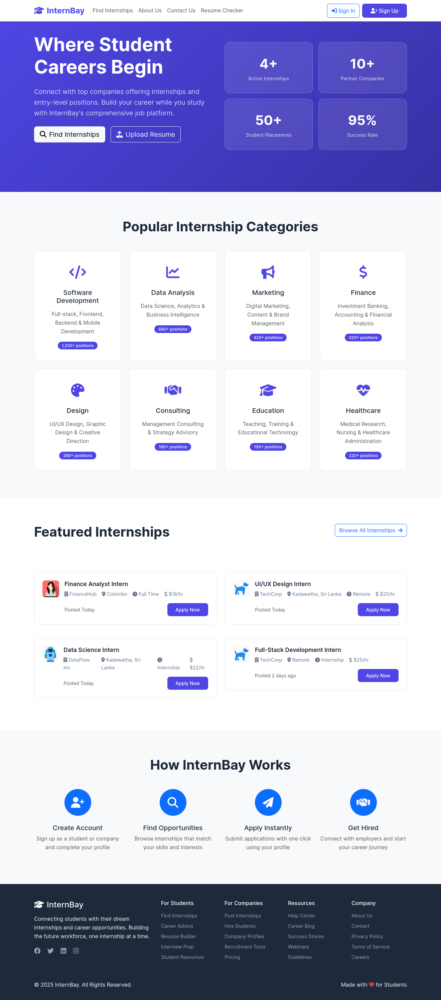
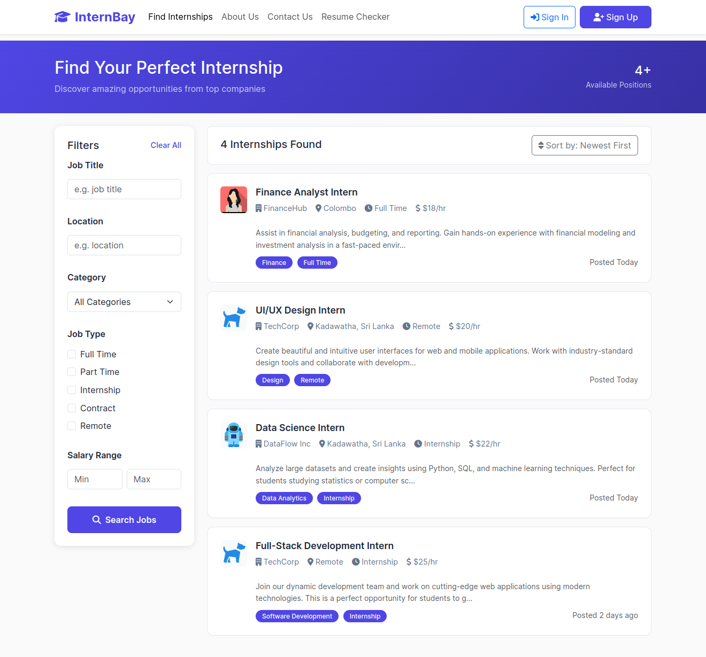
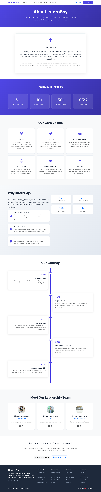
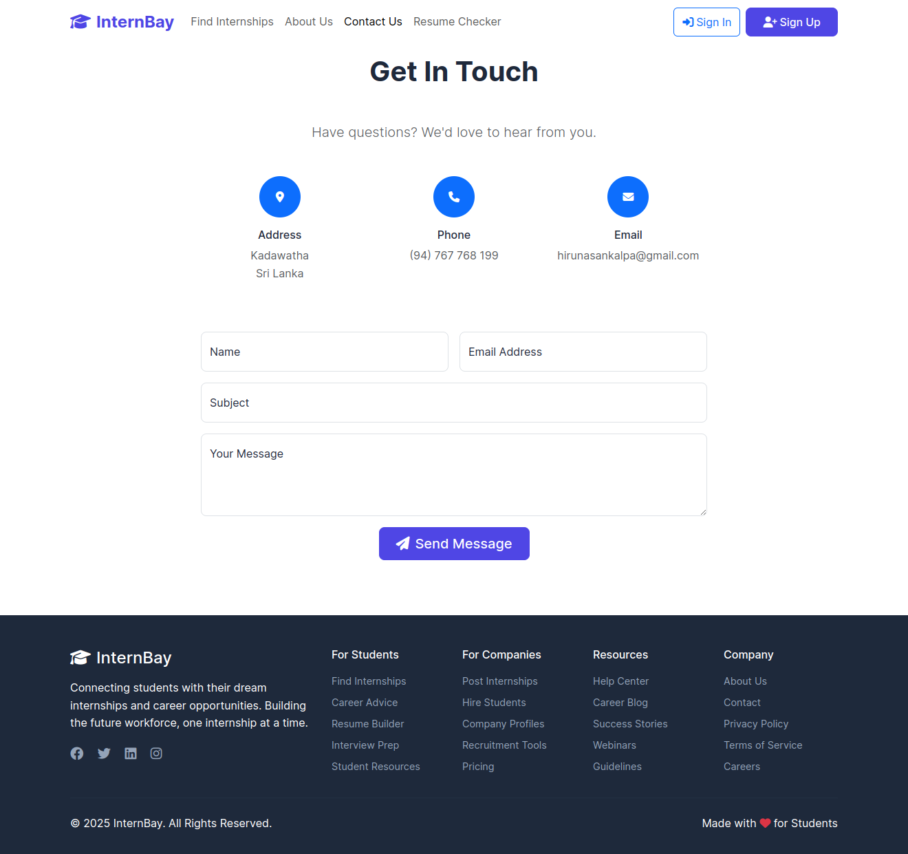
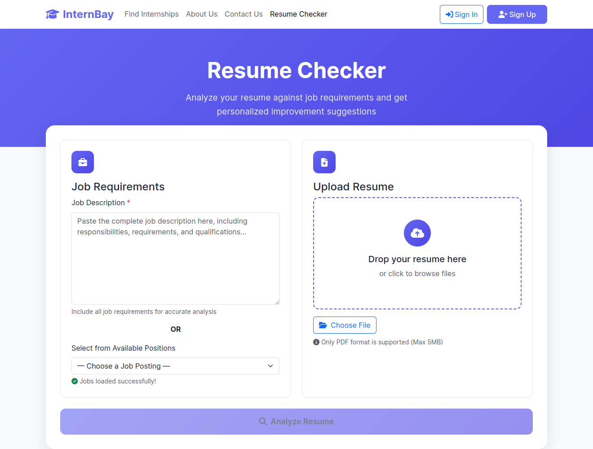

# 🎓 InternBay – A Campus Internship & Job Portal  

A modern Internship and Job Portal built with **Spring Boot, Spring Security (JWT), Hibernate/JPA, MySQL, and REST APIs**.  
It connects **students, employers, and administrators** in one platform, making internship/job applications seamless.  

---

## 🚀 Technologies Used  

- **Backend:** Spring Boot 3, Spring Security (JWT), Hibernate/JPA, Lombok  
- **Database:** MySQL  
- **Authentication:** JWT-based authentication & role-based access  
- **IDE:** IntelliJ IDEA  

---

## 📚 Features  

### 🔑 Authentication & Authorization  
- Secure **JWT-based login system**  
- Role-based access (**Admin**, **Employer**, **Candidate**)  
- Session-less API security  

### 🧑‍🎓 Candidate 
- 📝 Register & manage student profile  
- 📂 Browse internships & jobs  
- 📤 Apply to opportunities  
- 📋 View application history & status updates  

### 🏢 Employer  
- 📝 Create & manage job postings  
- 📂 Filter applicants for each posting  
- ✅ Approve / reject student applications  
- 🧠 Manage employer profiles  

### 🛠️ Admin   
- 👀 Manage all users (students, employers)  
- 🗄️ Manage job categories & postings  
- 🔒 Monitor system security and usage  

---

## 📂 Project Structure  

## ⚙️ Setup Instructions  

### 1. Clone Repository

git clone https://github.com/hirunadissanayake/InternBay-job-portal.git

cd internbay

### 2. Backend Setup (Spring Boot)

Import project into IntelliJ IDEA (Maven project).

Configure database in application.properties:

spring.datasource.url=jdbc:mysql://localhost:3306/internbay
spring.datasource.username=root
spring.datasource.password=yourpassword
spring.jpa.hibernate.ddl-auto=update
jwt.secret=your256bitsecretkey

Run the backend:

mvn spring-boot:run

## 📸 UI Screenshots

### Main Page
  

### Find Internship
  

### About Us
  

### Contact Us
  

### ResumeChecker
  

### Post Job (Employer only)
  

### Manage Job (Employer only)
  

