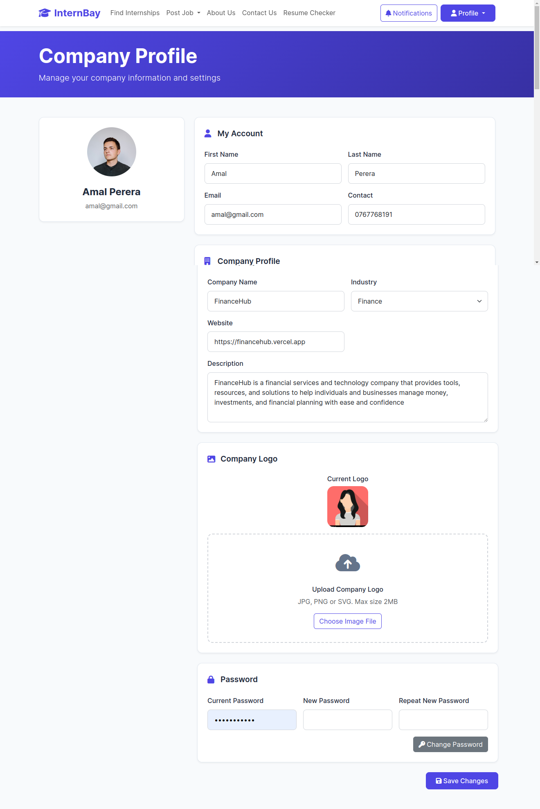
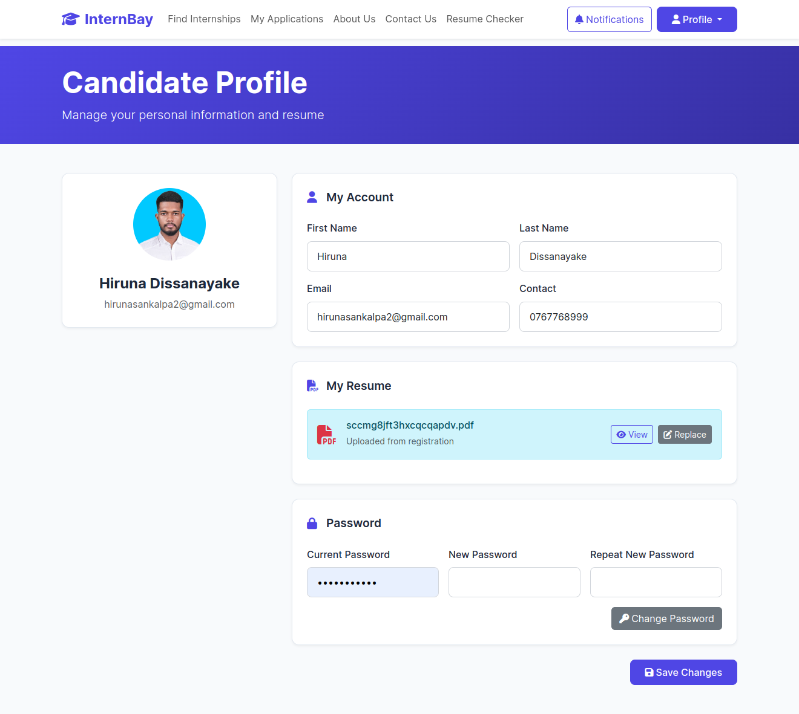
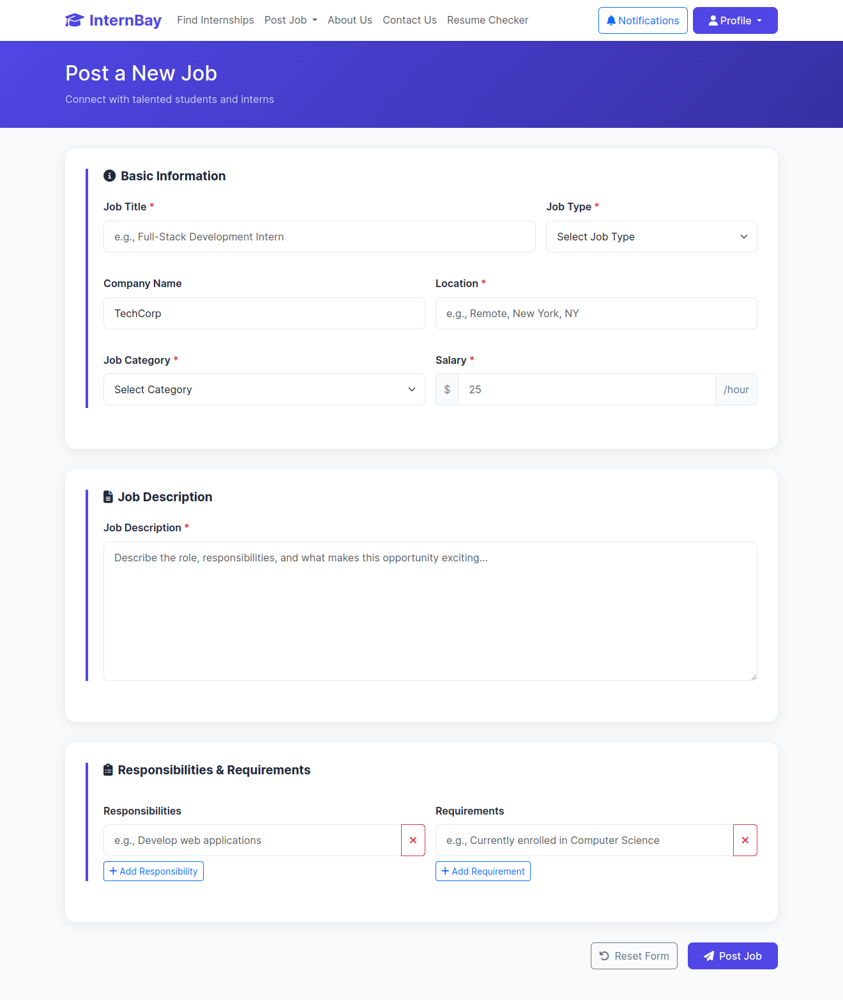
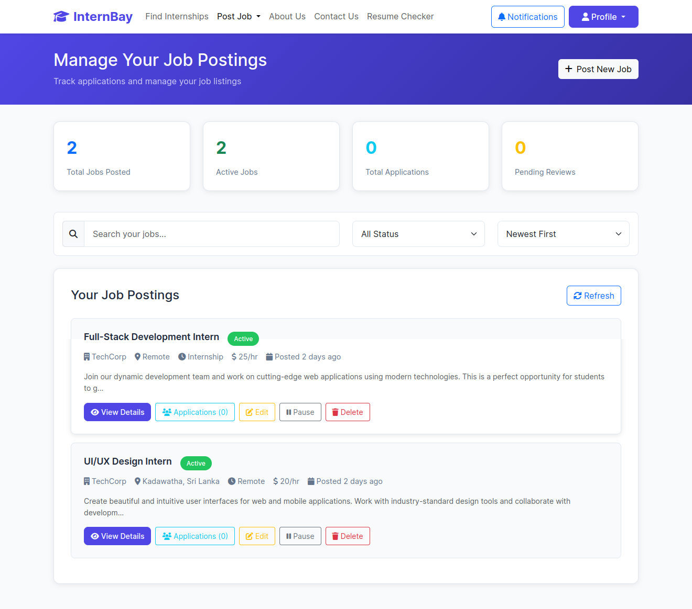

# 🎓 InternBay – A Campus Internship & Job Portal  

A modern Internship and Job Portal built with **Spring Boot, Spring Security (JWT), Hibernate/JPA, MySQL, and REST APIs**.  
It connects **students, employers, and administrators** in one platform, making internship/job applications seamless.  

---

## 🚀 Technologies Used  

- **Backend:** Spring Boot 3, Spring Security (JWT), Hibernate/JPA, Lombok  
- **Database:** MySQL  
- **Authentication:** JWT-based authentication & role-based access  
- **IDE:** IntelliJ IDEA  

---

## 📚 Features  

### 🔑 Authentication & Authorization  
- Secure **JWT-based login system**  
- Role-based access (**Admin**, **Employer**, **Candidate**)  
- Session-less API security  

### 🧑‍🎓 Candidate 
- 📝 Register & manage student profile  
- 📂 Browse internships & jobs  
- 📤 Apply to opportunities  
- 📋 View application history & status updates  

### 🏢 Employer  
- 📝 Create & manage job postings  
- 📂 Filter applicants for each posting  
- ✅ Approve / reject student applications  
- 🧠 Manage employer profiles  

### 🛠️ Admin   
- 👀 Manage all users (students, employers)  
- 🗄️ Manage job categories & postings  
- 🔒 Monitor system security and usage  

---

## 📂 Project Structure  

```internbay-job-portal/
├── .idea/
├── assets/
├── docs/
├── internbayBackEnd/
│ ├── src/
│ │ ├── main/
│ │ │ ├── java/
│ │ │ │ └── lk/ijse/gdse/main/internbaybackend/
│ │ │ │ ├── config/
│ │ │ │ ├── controller/
│ │ │ │ ├── dto/
│ │ │ │ ├── entity/
│ │ │ │ ├── exceptions/
│ │ │ │ ├── repository/
│ │ │ │ ├── service/
│ │ │ │ ├── util/
│ │ │ │ └── InternbayBackEndApplication.java
│ │ │ └── resources/
│ │ └── test/
│ ├── target/
│ ├── internbayBackEnd.iml
│ └── pom.xml
│
├── internbayFrontEnd/
│ ├── css/
│ ├── js/
│ ├── lib/
│ ├── pages/
│ └── index.html
│
├── LICENSE
├── README.md
├── internbay-job-portal.iml
```
## ⚙️ Setup Instructions  

### 1. Clone Repository

git clone https://github.com/hirunadissanayake/InternBay-job-portal.git

cd internbay

### 2. Backend Setup (Spring Boot)

Import project into IntelliJ IDEA (Maven project).

Configure database in application.properties:

spring.datasource.url=jdbc:mysql://localhost:3306/internbay
spring.datasource.username=root
spring.datasource.password=yourpassword
spring.jpa.hibernate.ddl-auto=update
jwt.secret=your256bitsecretkey


Run the backend:

mvn spring-boot:run

## 📸 UI Screenshots

### Main Page
  


### Find Internship
  


### About Us
  


### Contact Us
  


### ResumeChecker
  


### Employer Profile



### Candidate profile



### Post Job (Employer only)
  


### Manage Job (Employer only)
  


### Apply Job (Candidate only)


### Job Details Card 


## 🎥 Demo Video
[Watch on YouTube]()